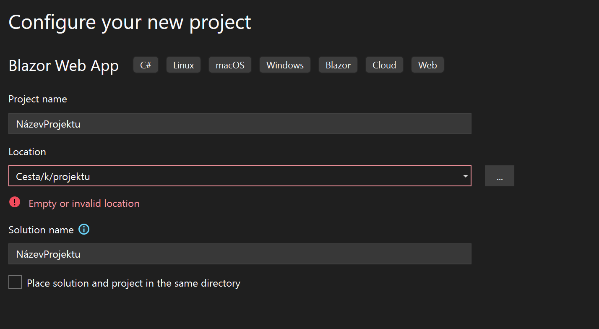

**Blazor**

Projekt pro předmět GUI zaměřený .NET Blazor

# Založení projektu pomocí CMD
```
    dotnet new blazor -n [název_projektu] -f net8.0
```
# Založení pomocí Visual studia
* Výběr templatu


* Tvorba projektu


* Technická specifika projektu


# Blazor TODO Aplikace

Tato aplikace je jednoduchý **TODO seznam** vytvořený v Blazor Server. Umožňuje uživateli přidávat, upravovat, mazat a přesouvat úkoly mezi seznamy.

## Jak spustit projekt
1. Naklonuj repozitář:
```bash
git clone https://github.com/Mysczk/Blazor.git
cd Blazor/BlazorDemo
```
2. Spusť Blazor Server aplikaci:
```bash
dotnet watch run
```
3.Otevři v prohlížeči *http://localhost:5000*

## Funkcionalita
- Přidání nového úkolu
- Přidání nového seznamu úkolů
- Úprava úkolu (název, popis, termín)
- Odstranění úkolu
- Přesouvání úkolů mezi seznamy
- Dynamické rozhraní s [Blazor Bootstrap](https://demos.blazorbootstrap.com/buttons)

## Use-case diagram TODO: dodat obrázek
```plaintext
      +----------------+
      |    Uživatel    |
      +----------------+
              |
      +-----------------+
      | Správa úkolů    |
      | - Přidat        |
      | - Upravit       |
      | - Smazat        |
      | - Přesunout     |
      +-----------------+
              |
      +---------------------+
      | Seznamy úkolů       |
      | (ToDo, InProgress,  |
      |  Done, ...)         |
      +---------------------+
```
## Struktura projektu

```plaintext
/BlazorDemo
│── /Components
│   ├── /Layout
│   │   ├── MainLayout.razor
│   │   ├── NavMenu.razor
│── /Pages
│   │   ├── Home.razor # Hlavní stránka
│   │   ├── Todo.razor # Stránka která zobrazuje Todo aplikaci
│── /Shared
│   │   ├── TaskItem.razor # Komponenta pro jednotlivý úkol
│   │   ├── TaskList.razor # Komponenta pro seznam úkolů
│   │   ├── AddTaskForm.razor # Komponenta pro přidání úkolu
│   │   ├── TaskItemDetails.razor # Sidebar s detaily úkolu
│   ├── _Imports.razor
│   ├── App.razor
│   ├── Routes.razor
│── /Data
│   ├── tasks.json # JSON kde se ukládají data
│── /Models
│   ├── TaskListModel.cs # Model pro seznam úkolů 
│   ├── TaskModel.cs # Model pro jednotlivý úkol
│── /Services
│   ├── TaskService.cs # Service který řeší všechny funkcionality 
│── /wwwroot
│   ├── styles.css         # Vlastní CSS
│── appsettings.Development.json
│── appsettings.json
│── BlazorDemo.csproj # Projektový soubor
│── Program.cs # Start aplikace
│── Blazor.sln
```

## Ukázky kódu pro přidání seznamu úkolů
### Komponenta `AddTaskListForm.razor`
```razor
<div class="add-task-form">
    <input @bind="newTaskListName" placeholder="Zadejte název seznamu" @bind:event="oninput" @onkeypress="HandleKeyPress" />
    <Button @onclick="AddTaskList" Color="ButtonColor.Primary">Přidat seznam</Button>

    @if (!string.IsNullOrEmpty(errorMessage))
    {
        <p class="error">@errorMessage</p>
    }
</div>

@code {
    [Parameter]
    public EventCallback<string> OnTaskListAdded { get; set; }

    [Parameter]
    public List<TaskListModel> ExistingTaskLists { get; set; } = new();

    private string newTaskListName = string.Empty;
    private string? errorMessage;

    private async Task AddTaskList()
    {
        if (string.IsNullOrWhiteSpace(newTaskListName))
        {
            errorMessage = "Název seznamu nemůže být prázdný.";
            return;
        }

        if (ExistingTaskLists.Any(tl => tl.Name.Equals(newTaskListName, StringComparison.OrdinalIgnoreCase)))
        {
            errorMessage = $"Seznam '{newTaskListName}' již existuje!";
            return;
        }

        await OnTaskListAdded.InvokeAsync(newTaskListName);
        newTaskListName = string.Empty;
        errorMessage = null; // Resetujeme chybu
    }

    private async Task HandleKeyPress(KeyboardEventArgs e)
    {
        if (e.Key == "Enter")
        {
            await AddTaskList();
        }
    }
}
```
### Řešení přidání seznamu úkolů na stránce `Todo.razor`
```razor
    <div class="add-task-list-column">
        @if (showAddTaskListInput)
        {
            <AddTaskListForm OnTaskListAdded="HandleTaskListAdded" ExistingTaskLists="@GetTaskLists()" />
        }
        else
        {
            <Button @onclick="ShowAddTaskListInput" 
                    Color="ButtonColor.Primary" 
                    Size="ButtonSize.Medium"
                    Class="w-100 d-flex align-items-center justify-content-center">
                <Icon Name="IconName.Plus" Class="me-2" /> Přidat seznam
            </Button>
        }
    </div>

@code {
    private void HandleTaskListAdded(string newTaskListName)
    {
        TaskService.AddTaskList(newTaskListName);
        HideAddTaskListInput();
    }
}
```
### Přidání úkolu v `TaskService.cs`
```csharp
 public class TaskService
    {
        private List<TaskListModel> taskLists = new List<TaskListModel>(); // List všech seznamů úkolů | List of all task lists
        public void AddTaskList(string name)
        {
            taskLists.Add(new TaskListModel { Name = name });
        }
    }
```

# Úkol první:

